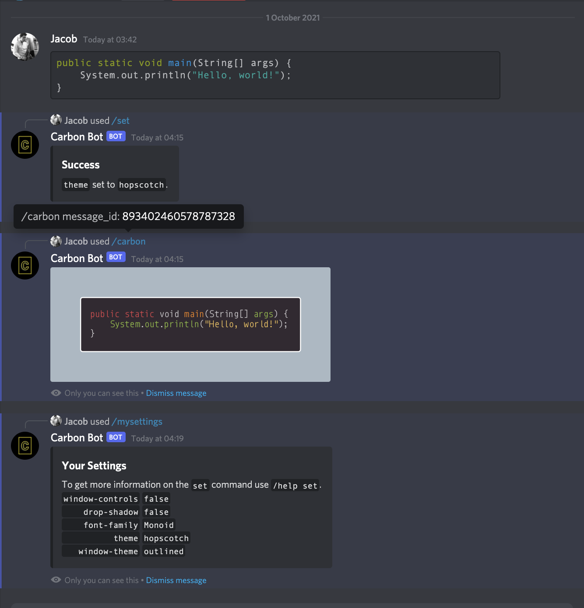

# Carbon Bot

A Discord bot to format code with [Carbon](https://carbon.now.sh), inspired by
[Carbonara](https://github.com/petersolopov/carbonara).

Invite Carbon Bot to your guild [here](https://discord.com/api/oauth2/authorize?client_id=892151455329427527&permissions=0&scope=applications.commands%20bot
).



## Contents

* [How It Works](#how-it-works)
* [Features](#features)
* [Commands](#commands)
* [Dependencies](#dependencies)
* [Configuration](#configuration)
* [Style](#style)

## How It Works

* User uses the `/carbon` command in Discord.
* Constructs a Carbon URI using the user's stored settings.
* Uses [Microsoft Playwright](https://github.com/microsoft/playwright-java) to visit Carbon.
* Screenshots the created image.
* Post the image to Discord.

## Features

* Use the majority of Carbon's configuration settings through Discord.
* User settings are persisted in Redis.
* Creates images of any message quickly.
* Parses code blocks to provide the correct syntax hilighting.

## Commands

The following commands are currently available.

* [Carbon](#carbon)
* [Help](#help)
* [Invite](#invite)
* [My Settings](#my-settings)
* [Set](#set)
* [Unet](#unset)

### Carbon

Creates an image of the message's contents using the user's stored settings, if any.

First, Carbon Bot tries to find a code block (delimited by three back ticks, \`\`\`) in the message's contents, as well as the code block's language (specified after the opening back ticks, e.g. \`\`\`java) for syntax hilighting, in which case an image is created with the code block's content. If a code block could not be found, then the message's contents are stripped of any surrounding back ticks and used.

#### Arguments

| Argument Name | Description               | Required |
| ------------- | ------------------------- | -------- |
| `message_id`  | The message's ID or link. | Yes      |

#### Syntax

`/carbon <message_id>`

---
### Help

Displays the help menu for all commands

#### Arguments

| Argument Name | Description                             | Required |
| ------------- | --------------------------------------- | -------- |
| `command`     | A command to display the help menu for. | No       |

> Currently, the only commands with sub-menus are `set` and `unset`.

#### Syntax

`/help <command>?`

#### Syntax Examples

`/help`, `/help set`

---
### Invite

Displays buttons to invite Carbon Bot
#### Syntax

`/invite`

---
### My Settings

Displays your settings

#### Syntax

`/mysettings`

---
### Set

Changes a default setting. View all changable settings by using `/help set`.

#### Arguments

| Argument Name | Description                | Required |
| ------------- | -------------------------- | -------- |
| `setting`     | The setting to change.     | Yes      |
| `value`       | The value to change it to. | Yes      |

#### Syntax

`/set <setting> <value>`

#### Syntax Examples

`/set font-family Monoid`, `/set theme Hopscotch`, `/set window-style outlined`

---
### Unset

Restores a setting to default

#### Arguments

| Argument Name | Description                | Required |
| ------------- | -------------------------- | -------- |
| `setting`     | The setting to change.     | Yes      |

#### Syntax

`/unset <setting>`

#### Syntax Examples

`/unset font-family`, `/unset theme`, `/unset window-style`

## Dependencies

Carbon Bot is written in Java 16 and has the following dependencies.

* JDA
    * [GitHub](https://github.com/DV8FromTheWorld/JDA)
* Playwright
    * [GitHub](https://github.com/microsoft/playwright-java)
    * Playwright requires various dependencies to install browsers, see [the docs](https://playwright.dev/java/docs/cli#install-system-dependencies).
* Jedis
    * [GitHub](https://github.com/redis/jedis)
    * User settings are persisted in Redis.
* slf4j
    * [GitHub](https://github.com/qos-ch/slf4j)

## Configuration

The `config.properties` file requires the following three properties.
```properties
discord.bot.token=bot token
discord.invite.uri=invite url
redis.uri=redis://localhost:6379
```

## Style

The IntelliJ code style files, which are a fork of the [Google Java Style Guide](https://google.github.io/styleguide/javaguide.html), are stored in the `.idea/codeStyles` directory.
